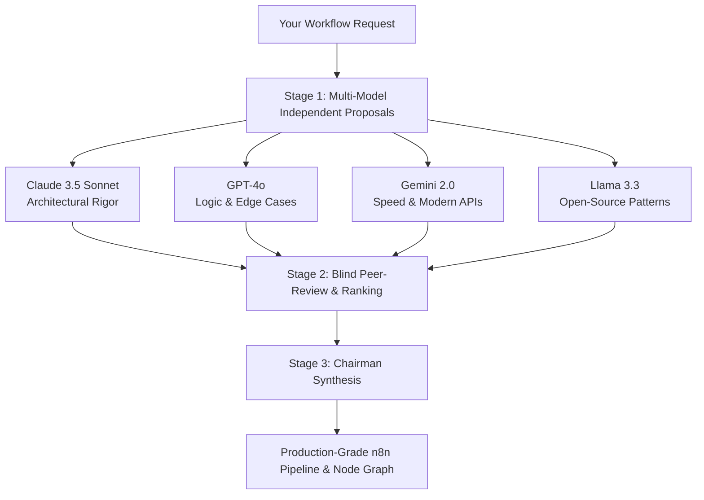

# Using LLM Council for High-Performance Workflow Creation

Andrej Karpathy's **LLM Council** is an ensemble deliberation engine that combines multiple leading AI models (Claude 3.5 Sonnet, GPT-4o, Gemini 2.0 Flash, Llama 3.3 70B) to eliminate single-model hallucinations and blind spots.

---

## 1. Quick Start (How to Launch on Windows)

### Option A: 1-Click Launch (Double-Click)
Double-click [**`start.bat`**](file:///c:/Users/sony/OneDrive/Desktop/n8n%20setup/llm-council/start.bat) in File Explorer.
* Automatically launches the FastAPI backend on `http://localhost:8001`
* Automatically launches the React Vite frontend on `http://localhost:5173`
* Opens your browser directly to `http://localhost:5173`

### Option B: PowerShell
```powershell
cd "c:\Users\sony\OneDrive\Desktop\n8n setup\llm-council"
.\start.ps1
```

---

## 2. API Key Configuration

Open [**`.env`**](file:///c:/Users/sony/OneDrive/Desktop/n8n%20setup/llm-council/.env) and enter your OpenRouter key:

```env
OPENROUTER_API_KEY=sk-or-v1-your_openrouter_api_key_here
COUNCIL_MODELS=anthropic/claude-3.5-sonnet,openai/gpt-4o,google/gemini-2.0-flash-001,meta-llama/llama-3.3-70b-instruct
CHAIRMAN_MODEL=anthropic/claude-3.5-sonnet
```

*(Get an API key at [openrouter.ai/keys](https://openrouter.ai/keys)).*

---

## 3. How the 3-Stage Deliberation Upgrades Workflow Creation

When creating complex automation workflows (e.g., in n8n, LangChain, or AWS):



1. **Stage 1 (First Opinions)**: Each LLM independently drafts their proposed node topology, triggers, data transformations, error recovery, and webhook handling.
2. **Stage 2 (Blind Peer Review)**: Every model reviews the others' workflow architectures anonymously without knowing which model designed it. They ruthlessly catch:
   - Rate limiting pitfalls
   - Webhook timeout risks
   - Fragile JSON parsing
   - Missing fallback routes
3. **Stage 3 (Chairman Synthesis)**: The Chairman merges the best elements of each proposal into a definitive, hardened blueprint.

---

## 4. Copy-Paste Prompts for Workflow Creation

### Prompt 1: Designing a Resilient n8n Pipeline
```text
I am designing an n8n automation workflow to solve [DESCRIBE PROBLEM, e.g. scraping LinkedIn signals and drafting hyper-personalized outreach].

Council requirements:
1. Provide the exact recommended node graph (Triggers, Code nodes, AI chains, Error handlers).
2. Specify exact data schemas passed between nodes to prevent runtime crashes.
3. Identify top 3 failure modes (e.g., rate limits, API timeouts, malformed JSON) and how the workflow recovers.
4. Output a clean, modular structure ready to be converted into an n8n JSON canvas.
```

### Prompt 2: Stress-Testing an Existing Automation
```text
Here is my current workflow logic:
[PASTE WORKFLOW LOGIC OR NODE FLOW]

Evaluate this architecture for:
- Scalability to 1,000+ daily runs
- Failure points and unhandled exceptions
- Cost efficiency (API token usage and compute)
- Alternative node arrangements that simplify execution
```
